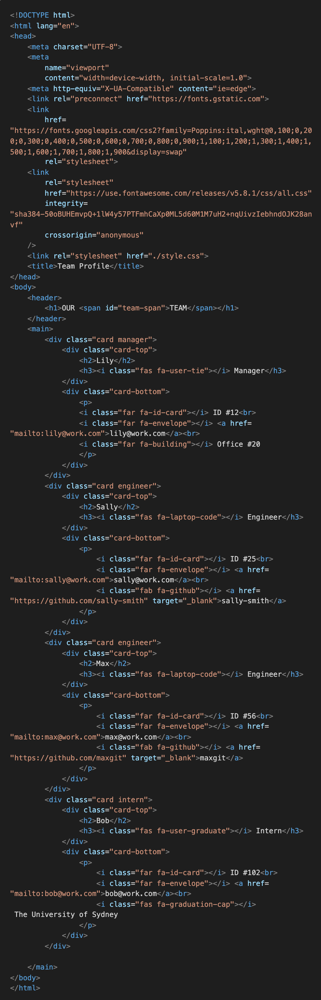

# Team Profile Generator 

## Description

This is a command-line application that generates simple team profile HTML files from the user's responses to the command-line prompts.
The user must input information about a team manager, and can also choose to add however many engineers and interns as needed to the team.

## Installation 

1. Clone this repository to your local computer 
2. In the command line, navigate to the cloned repository (the 'team-profile-generator' directory)
3. Install the required dependencies (npm inquirer and npm jest) by running the command: **npm install**

## Tests

- To run the application tests, enter the command: **npm run test**

## Video Walkthrough

[Click here](https://drive.google.com/file/d/1EgfNIgPM4sPaRfBSZoKfzu68dSq631Oc/view) to watch a video walkthrough of the application tests & functionality.

## Technologies Used 
- JavaScript
- Command-line interface
- node.js
- npm inquirer package
- npm jest package 
- HTML
- CSS 

## Screenshots 

### Application interface

### Generated HTML file source code

### Team profile HTML page

#### Desktop/laptop view 

#### Responsive design

## Questions

**My Github Profile**: [jkaho](https://github.com/jkaho)

If you have any further questions, feel free to email me at [j.h_7@yahoo.com](mailto:j.h_7@yahoo.com)

